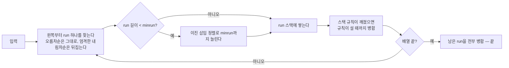
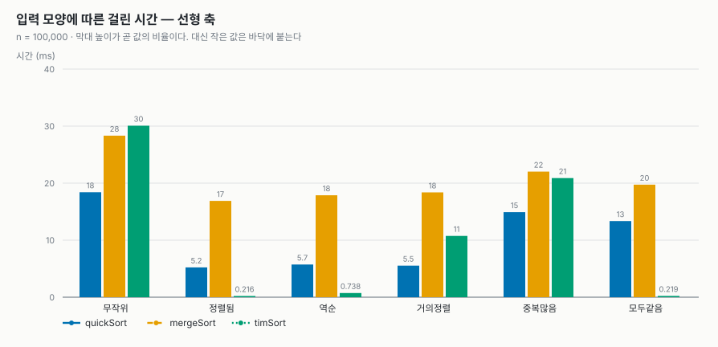
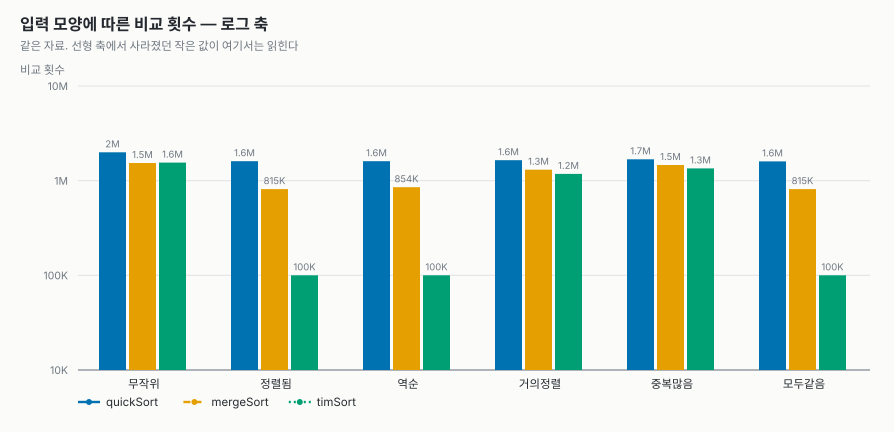
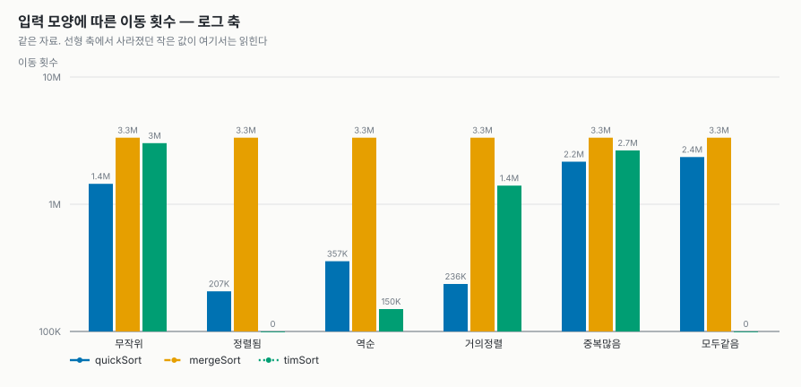
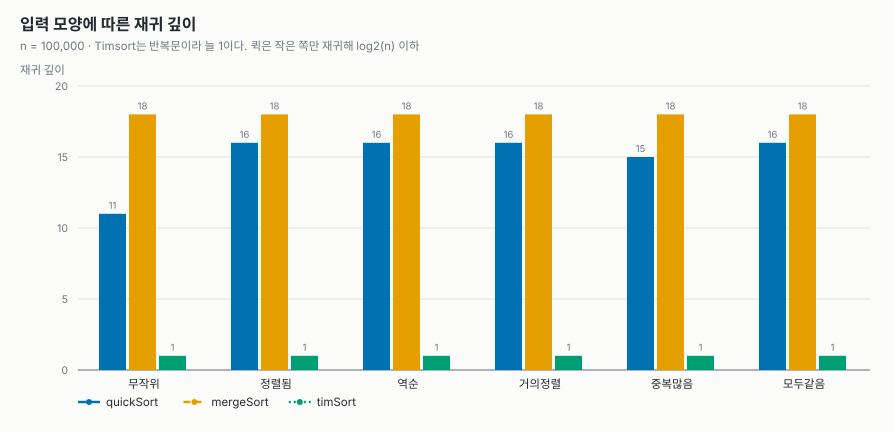
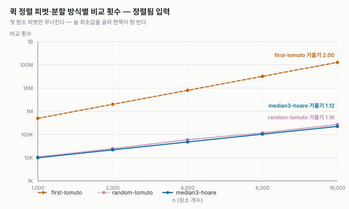
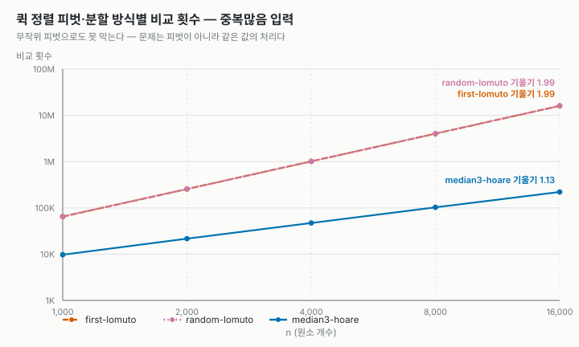
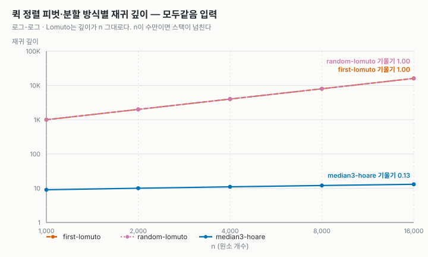
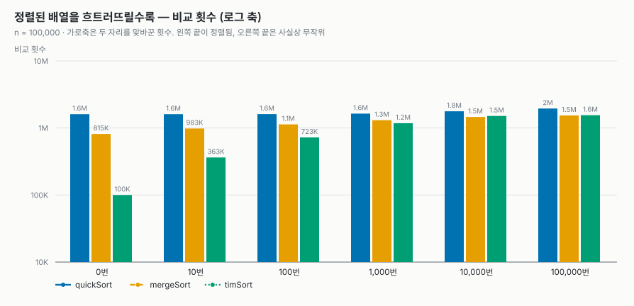

# 정렬 비교 보고서 — 퀵 · 병합 · Timsort

배운 정렬 둘(**퀵 정렬 · 병합 정렬**)과 배우지 않은 정렬 하나(**Timsort**)를
**하나의 공통 인터페이스**로 묶고, 같은 잣대로 속도 · 메모리 · 안정성을 잰 결과다.

- **GitHub 저장소: <https://github.com/jkn614/algorithms-hw1>**
- 구현: [`src/quickSort.c`](https://github.com/jkn614/algorithms-hw1/blob/main/src/quickSort.c) · [`src/mergeSort.c`](https://github.com/jkn614/algorithms-hw1/blob/main/src/mergeSort.c) ·
  [`src/timSort.c`](https://github.com/jkn614/algorithms-hw1/blob/main/src/timSort.c)
- 실행: `make run` (비교 표) · `make test` (유닛 테스트 50개) · `make charts` (그래프)
- 환경: 컨테이너 안 `gcc -std=c17 -Wall -Wextra -O2`
- 출발점: 과제 샘플 저장소(`lec-algorithm/hw1-sample-2026`)의 인터페이스 · 측정 도구 ·
  그래프 스크립트를 그대로 쓰고, 정렬 셋과 실험을 바꿔 끼웠다.

---

## 0. 한눈에 보기

왜 이 셋을 골랐나. **Timsort는 병합 정렬에 "이미 정렬된 구간을 버리지 않는다"는
아이디어를 더한 것**이라 병합 정렬과 직접 견줄 수 있다. 퀵 정렬은 셋 중 유일한
**불안정 · 제자리** 정렬이라, 안정성과 메모리 열이 비로소 갈린다.

| | 퀵 정렬 | 병합 정렬 | Timsort |
| --- | --- | --- | --- |
| 시간 (최선 / 평균 / 최악) | n log n / n log n / n² | n log n / n log n / n log n | **n** / n log n / n log n |
| 추가 메모리 | 원소 1칸 + 재귀 스택 | **n칸** | 많아야 n/2칸 |
| 안정성 (실측) | **불안정** | 안정 | 안정 |
| 이 실험에서 이긴 곳 | **무작위 · 중복** (가장 빠름) | 어디서나 고른 성능 | **정렬됨 · 역순 · 모두같음** (78배) |
| 이 실험에서 진 곳 | 교과서형 분할은 O(n²)으로 무너짐 | 정렬된 입력에서도 똑같이 일함 | 무작위 입력에서는 셋 중 가장 느림 |

**한 줄 결론:** 셋 다 O(n log n)이지만 **입력 모양을 빼고는 누가 빠른지 말할 수 없다.**
무작위 데이터에서는 이동이 적은 퀵 정렬이, 이미 정리된 데이터에서는 run을 찾는
Timsort가 압도적이고, 병합 정렬은 어느 쪽에서도 1등은 아니지만 무너지지도 않는다.

---

## 1. 코드 보고서

### 1.1 공통 인터페이스 (샘플에서 물려받은 것)

샘플 저장소의 설계를 그대로 쓴다. 정렬 하나는 **함수 포인터를 담은 구조체** 하나이고,
부르는 쪽(`main.c` · `bench.c` · 테스트)은 구현 표만 훑는다. 그래서 정렬 셋을 바꿔
끼우는 일이 **표의 세 줄을 바꾸는 것**으로 끝났다.

```c
/* src/sort.c */
const SortAlgorithm SORT_ALGORITHMS[] = {
    {"quickSort", "O(n log n)", "O(log n)", 0, quickSort},   /* stable = 0 */
    {"mergeSort", "O(n log n)", "O(n)",     1, mergeSort},
    {"timSort",   "O(n log n)", "O(n)",     1, timSort},
};
```

`stable` 열에 퀵 정렬만 `0`을 적었다. 이 값은 **주장**일 뿐이고, 테스트가 실측과
맞춰 본다(→ [1.3 검증](#13-검증)).

### 1.2 샘플에서 바꾼 것

| 바꾼 곳 | 무엇을 · 왜 |
| --- | --- |
| `quickSort.c` · `mergeSort.c` · `timSort.c` | 새로 작성. 샘플의 삽입 · 버블 · 블록 정렬 자리에 들어갔다 |
| `sortctx.h` · `sort.c` | `sortComparePtr` · `sortNoteDepth` · `sortNoteExtra` 추가 — 보조 배열 안의 원소끼리 비교하고, 보조 메모리와 재귀 깊이를 측정값에 알린다 |
| `sort.h` | `quickSortScheme` 추가 — 퀵 정렬의 피벗 · 분할 방식을 바꿔 가며 재는 실험용 |
| `bench.c` · `main.c` | 입력 모양 **거의정렬 · 모두같음** 추가. n을 100,000까지 키우고(샘플의 4,000에서는 O(n log n) 셋의 시간이 너무 작다) `--quick` · `--disorder` 실험 추가 |
| `tests/test_sort.c` | 42개 → **50개**. 불안정 정렬을 받아들이고, 큰 입력 · 톱니 입력 · 피벗 방식 검사를 더했다 |
| `tools/` | 그래프를 새 실험에 맞게 다시 짜고, 제출용 PDF를 만드는 `pdf.mjs`를 더했다 |

### 1.3 검증

```console
$ make test
...
50 checks, 0 failures
```

| 검사 | 내용 |
| --- | --- |
| 기본 케이스 | 섞임 · 정렬됨 · 역순 · 중복 · 모두 같은 값 · 원소 1개 · 빈 배열 |
| 안정성 | `tag` 순서 실측이 구현 표의 `stable` 값과 일치하는지. **퀵 정렬은 "실제로 불안정한지"를 본다** |
| `n = 0..200` 전수 | 크기마다 정렬 확인. 안정 정렬이라 주장한 구현에만 안정성까지 요구한다 |
| `qsort` 대조 | 난수 500개 |
| **큰 입력 · 톱니** (추가) | `n = 5,000`에서 입력 모양 6가지 + 길이가 1, 2, 3, …으로 자라는 run이 이어진 "톱니" 입력. Timsort의 run 스택 규칙은 run이 많이 쌓이는 큰 입력에서만 흔들린다 |
| **피벗 방식 셋** (추가) | 실험용 Lomuto 방식도 느릴 뿐 결과는 맞는지 |
| 측정 도구 | `makeInput`의 여섯 모양, 안정성 판정기가 위반을 잡는지 |

**ASan · UBSan**(`-fsanitize=address,undefined`)을 붙여 같은 테스트를 돌려도 경고가 없다.

**테스트가 실제로 잡는지도 확인했다(변이 테스트).** 비교 연산자 한 글자를 일부러
바꾸고 테스트가 실패하는지 본다.

| 망가뜨린 곳 | 결과 |
| --- | --- |
| 병합 정렬 병합의 `<` → `<=` | 검사 **4개** 실패 (안정성이 깨진다) |
| Timsort 내림차순 run의 `<` → `<=` | 검사 **2개** 실패 (같은 값이 섞인 구간을 뒤집어 안정성이 깨진다) |
| Timsort `mergeHi`의 `<` → `<=` | 검사 **3개** 실패 |
| Timsort 이진 삽입의 `>` → `>=` | 검사 **4개** 실패 |
| Timsort 병합 전 잘라 내기의 `upperBound` → `lowerBound` | **0개 실패 — 등가 변이다.** 같은 값을 잘라 내지 않고 병합에 넘길 뿐이고, 병합이 같은 값을 왼쪽 먼저 놓으므로 결과가 똑같다. 비교 횟수만 조금 는다 |

마지막 줄은 테스트의 구멍이 아니라 **바꿔도 틀리지 않는 자리**라는 뜻이다.
안정성을 지키는 곳은 잘라 내기가 아니라 병합 쪽의 `<` 한 글자다.

---

## 2. 알고리즘 상세

### 2.1 퀵 정렬 — 피벗을 골라 둘로 나눈다

피벗 하나를 골라 "피벗보다 작은 것 | 피벗 | 큰 것"으로 나누고, 양쪽을 다시 정렬한다.
나누는 일이 곧 정렬이라 합치는 단계가 없고, 추가 배열도 없다. 원소가 2개 이하가 되면 직접 비교하고 끝낸다.

이 구현이 기본값으로 쓰는 것은 세 가지 선택의 조합이다. 셋 다 **교과서형이 무너지는
자리를 하나씩 막는다**(→ [3.5 피벗 실험](#35-퀵-정렬-피벗분할-방식-실험)).

| 선택 | 막는 것 |
| --- | --- |
| **세 값의 중앙값** 피벗 | 첫 원소를 피벗으로 쓰면, 정렬된 입력에서 늘 최솟값을 골라 한쪽이 텅 빈다 |
| **Hoare 분할** — 피벗과 **같은 값에서도 멈춘다** | Lomuto 분할은 같은 값을 전부 한쪽으로 보낸다. 모두 같은 입력에서 O(n²) |
| **작은 쪽만 재귀** | 양쪽을 다 재귀하면 최악에 깊이 n → 스택 오버플로. 작은 쪽은 늘 절반 이하라 깊이 ≤ log₂ n |

Hoare 분할의 핵심은 비교가 `<`와 `>`라는 것이다.

```c
do { i++; } while (i < hi && sortCompareAt(c, i, lo) < 0);   /* 피벗과 같으면 멈춘다 */
do { j--; } while (sortCompareAt(c, j, lo) > 0);             /* 여기도 */
```

같은 값에서 양쪽이 멈추므로 같은 값끼리 **괜히 맞바꾸게** 된다(모두같음 입력에서 이동
235만 회). 그 대신 i와 j가 가운데서 만나 배열이 정확히 반으로 갈린다. 쓸데없어 보이는
교환이 O(n²)을 막는 값이다.

**퀵 정렬은 불안정하다.** 분할이 멀리 떨어진 원소끼리 맞바꾸기 때문에 같은 key의
앞뒤가 뒤집힌다. 고칠 대상이 아니라 이 알고리즘의 성질이다.

### 2.2 병합 정렬 — 반으로 나눠 정렬하고 합친다

원소 하나짜리 배열은 늘 정렬되어 있다. 반씩 쪼개 내려가 거기서부터 합쳐 올라온다(`8 3 5 1` → `3 8`, `1 5` → `1 3 5 8`).
합칠 때 원본을 덮어쓰며 읽을 수는 없으므로, **크기 n인 보조 배열**을 한 번 잡아 두고
병합마다 재사용한다. 이것이 병합 정렬의 대가다(실측 800,008 B).

안정성은 병합의 비교 한 글자가 만든다. 오른쪽이 **엄격히 작을 때만** 오른쪽을 가져온다.

```c
if (sortComparePtr(c, aux + j * sz, aux + i * sz) < 0) { /* '<='이면 불안정해진다 */
```

수업에서 배운 형태 그대로 두었다. "왼쪽 반의 끝이 오른쪽 반의 처음보다 작으면
병합을 건너뛴다" 같은 최적화를 넣지 않았다. 그래야 Timsort가 무엇을 더했는지가
실험에서 선명하게 드러난다. 그 결과 병합 정렬은 **어떤 입력에서도 이동 횟수가
3,337,856회로 똑같다** — 입력을 보지 않는다는 뜻이다.

### 2.3 Timsort — 이미 정렬된 구간(run)을 찾아 병합한다

배우지 않은 정렬이라 개념 설명은 [4장](#4-timsort--ai와-함께-학습한-내용)에 따로 두고,
여기서는 **이 구현이 실제로 하는 일**만 적는다.



**① run 찾기.** 오름차순 구간은 같은 값을 허용하고(`>=`), 내림차순 구간은
**엄격히 작아질 때만**(`<`) 이어 간다. 같은 값이 섞인 내림차순 구간을 뒤집으면 같은
값의 앞뒤가 바뀌기 때문이다(변이 테스트로 확인 → 검사 2개 실패).

**② minrun.** run이 너무 짧으면(무작위 입력은 run 길이가 2–3이다) 병합이 너무 많아진다.
그래서 짧은 run은 **이진 삽입 정렬**로 minrun까지 늘린다. minrun은 n에 따라 32–64 중
하나로, `n / minrun`이 2의 거듭제곱에 가깝게 고른다. 그래야 마지막 병합들이 비슷한
길이끼리 일어난다. 삽입 정렬은 O(n²)이지만 64개 이하에서는 가장 빠른 축이다.

**③ run 스택의 규칙.** 스택 위쪽 run 길이를 X, Y, Z(Z가 맨 위)라 할 때

```
X > Y + Z   그리고   Y > Z
```

가 늘 서도록 병합한다. 그러면 아래로 갈수록 run 길이가 피보나치 수보다 빨리 커져
스택 깊이가 O(log n)으로 묶이고, 병합이 **비슷한 길이끼리** 일어난다 — 병합 정렬이
"반으로" 나눠서 얻는 균형을, 정해진 분할 없이 얻는 방법이다. 원래 규칙은 맨 위 셋만
봤는데 그것으로는 불변식이 깨질 수 있다는 것이 뒤에 밝혀져서, 넷째까지 보는
수정판(Java TimSort와 같은 것)을 썼다.

예: 스택이 X = 120, Y = 80일 때 Z = 50을 쌓으면 120 ≤ 80 + 50이라 Y와 Z를 병합해
(120, 130)이 되고, 다시 120 ≤ 130이라 둘을 병합해 250 하나가 된다.

**④ 병합.** 두 run A(왼쪽) · B(오른쪽)를 합치기 전에 **이미 제자리인 부분을 잘라 낸다.**

- A의 앞부분 중 `B[0]` 이하인 원소는 움직일 필요가 없다 → 이분 탐색으로 찾아 제외
- B의 뒷부분 중 `A[마지막]` 이상인 원소도 마찬가지

그다음 **짧은 쪽만** 보조 배열에 복사해 병합한다. A가 짧으면 앞에서부터(`mergeLo`),
B가 짧으면 뒤에서부터(`mergeHi`) 채운다. 그래서 보조 배열은 **많아야 n/2칸**이다
(실측 398,576 B ≈ 100,000 / 2 × 8 B). 병합 정렬의 절반이다.

> **이 구현은 수업용으로 줄인 판이다.** CPython · Java의 Timsort에 있는 **galloping 모드**
> (병합 중 한쪽 run에서 원소가 연달아 이기면 지수 탐색으로 한꺼번에 건너뛰는 것)를
> 넣지 않았다. 병합 전 잘라 내기도 원본의 지수 탐색 대신 이분 탐색이다.
> 이 차이가 실험 결과에 어떻게 나타나는지는 [3.6](#36-흐트러짐-실험--timsort는-어디까지-이득인가)에 적었다.

---

## 3. 알고리즘 실험

### 3.1 실험 개요

측정 도구는 샘플의 것을 그대로 쓴다. 정렬은 자기가 측정당하는 줄 모른다.

| 재는 것 | 방법 | 주의 |
| --- | --- | --- |
| 시간 | `clock()`, 입력 복사를 뺀 구간, 3–50회 평균 | 기계 · 부하에 흔들린다. **같은 표 안에서만** 견줄 것 |
| 비교 · 이동 | 구현이 `SortStats`에 센다 | 입력이 고정이라 언제 돌려도 같다. 보고서는 이쪽을 앞세운다 |
| 추가 메모리 | `extraBytes` — 입력 배열 밖에 잡은 최대 바이트 | 재귀 스택은 여기 들지 않는다 → 재귀 깊이로 따로 본다 |
| 재귀 깊이 | `maxDepth` | 스택 사용량의 대리 지표 |
| 안정성 | 원소를 `(key, tag)`로 만들고, 정렬 뒤 같은 key끼리 tag 순서를 본다 | 같은 key가 있어야만 드러난다 |

입력 모양은 여섯 가지다. 씨앗을 고정해 매번 같은 입력을 쓴다.

| 입력 | 만드는 법 | 무엇을 보려고 |
| --- | --- | --- |
| 무작위 | `rand()` | 평균적인 경우 |
| 정렬됨 · 역순 | `i` · `n - i` | 교과서형 퀵의 최악, Timsort의 최선 |
| **거의정렬** (추가) | 정렬된 배열에서 두 자리를 n/100번 맞바꿈 | 실제 데이터에 흔한 "대체로 정리된" 상태 |
| 중복많음 | 서로 다른 값 8개 | 같은 값 처리 |
| **모두같음** (추가) | 전부 7 | 같은 값 처리의 극단. 퀵 정렬 분할 방식의 시험대 |

아래 표와 그래프는 **한 번의 같은 `make charts` 실행**에서 나왔고, 측정값 원본은
[`results.csv`](https://github.com/jkn614/algorithms-hw1/blob/main/report/results.csv) · [`quick-schemes.csv`](https://github.com/jkn614/algorithms-hw1/blob/main/report/quick-schemes.csv) ·
[`disorder.csv`](https://github.com/jkn614/algorithms-hw1/blob/main/report/disorder.csv)에 남겼다. 다시 돌리면 시간은 조금씩 달라지고,
비교 · 이동 횟수는 똑같이 나온다.

### 3.2 입력 모양별 (n = 100,000, 5회 평균)

| 입력 | 알고리즘 | 시간(ms) | 비교 | 이동 | 추가 메모리 | 재귀깊이 | 안정성(실측) |
| --- | --- | ---: | ---: | ---: | ---: | ---: | --- |
| 무작위 | **quickSort** | **18.407** | 1,995,560 | 1,446,195 | 8 B | 11 | no |
| 무작위 | mergeSort | 28.319 | 1,536,770 | 3,337,856 | 800,008 B | 18 | yes |
| 무작위 | timSort | 30.067 | 1,552,179 | 3,021,305 | 398,576 B | 1 | yes |
| 정렬됨 | quickSort | 5.221 | 1,606,802 | 206,784 | 8 B | 16 | yes |
| 정렬됨 | mergeSort | 16.882 | 815,024 | 3,337,856 | 800,008 B | 18 | yes |
| 정렬됨 | **timSort** | **0.216** | **99,999** | **0** | 8 B | 1 | yes |
| 역순 | quickSort | 5.726 | 1,606,803 | 356,790 | 8 B | 16 | yes |
| 역순 | mergeSort | 17.878 | 853,904 | 3,337,856 | 800,008 B | 18 | yes |
| 역순 | **timSort** | **0.738** | **99,999** | 150,000 | 8 B | 1 | yes |
| 거의정렬 | **quickSort** | **5.541** | 1,645,215 | 236,319 | 8 B | 16 | yes |
| 거의정렬 | mergeSort | 18.380 | 1,304,193 | 3,337,856 | 800,008 B | 18 | yes |
| 거의정렬 | timSort | 10.743 | 1,179,318 | 1,400,394 | 275,144 B | 1 | yes |
| 중복많음 | **quickSort** | **14.922** | 1,681,053 | 2,161,746 | 8 B | 15 | no |
| 중복많음 | mergeSort | 22.023 | 1,463,633 | 3,337,856 | 800,008 B | 18 | yes |
| 중복많음 | timSort | 20.887 | 1,348,619 | 2,650,436 | 348,664 B | 1 | yes |
| 모두같음 | quickSort | 13.351 | 1,598,987 | 2,351,874 | 8 B | 16 | no |
| 모두같음 | mergeSort | 19.735 | 815,024 | 3,337,856 | 800,008 B | 18 | yes |
| 모두같음 | **timSort** | **0.219** | **99,999** | **0** | 8 B | 1 | yes |

#### 걸린 시간




- **정렬됨 · 역순 · 모두같음에서 Timsort가 한 자릿수 이상 빠르다.** 정렬됨에서
  병합 정렬 16.882 ms 대 0.216 ms, **약 78배**. 배열 전체가 run 하나라서 훑기만 하고
  끝난다(비교 n-1 = 99,999번, 이동 0번).
- 역순도 run 하나다. **엄격한 내림차순 run을 한 번 뒤집을 뿐**이라 이동이
  150,000 = 교환 50,000번 × 3이다.
- **무작위 · 중복많음 · 거의정렬에서는 퀵 정렬이 가장 빠르다.** 무작위에서 퀵 정렬은
  비교를 병합 정렬보다 **1.3배 더** 하는데도 더 빠르다. 이유는 다음 두 그래프에 있다.

#### 비교 횟수와 이동 횟수




- 무작위 입력에서 비교는 병합 1,536,770 < 퀵 1,995,560이지만, **이동은 병합이
  3,337,856으로 퀵(1,446,195)의 2.3배다.** 병합 정렬은 모든 원소를 층마다 보조
  배열로 한 번, 다시 원래 배열로 한 번 옮긴다. 퀵 정렬은 잘못 놓인 원소만 옮긴다.
  원소 비교가 싼 이 실험(`int` 비교)에서는 **이동이 시간을 정한다.**
- 병합 정렬의 이동 횟수는 **여섯 입력 모두 3,337,856으로 같다.** 입력을 보지 않고
  늘 같은 일을 한다. 좋게 말하면 예측 가능하고, 나쁘게 말하면 정렬된 입력에서도
  그만큼 일한다.
- 병합 정렬이 정렬됨 · 모두같음에서 비교가 절반(815,024)으로 주는 것은, 병합할 때
  왼쪽 반이 먼저 다 떨어지면 나머지를 비교 없이 옮기기 때문이다. 이동은 줄지 않는다.
- **거의정렬(1%만 흐트러짐)에서 Timsort의 이득은 생각보다 작다** — 비교는 셋 중
  가장 적지만(1,179,318) 시간은 퀵 정렬의 두 배다. 흩어진 1,001번의 맞바꿈이 긴 run을
  잘게 끊기 때문이다. 이 경계를 [3.6](#36-흐트러짐-실험--timsort는-어디까지-이득인가)에서 따로 쟀다.

#### 추가 메모리와 재귀 깊이




- **병합 정렬은 입력이 무엇이든 800,008 B**(원소 10만 칸 + `tmp` 한 칸)다.
- **Timsort는 입력을 탄다.** 병합할 run이 없으면(정렬됨 · 역순 · 모두같음) 보조 배열을
  아예 잡지 않아 8 B, 병합이 있으면 짧은 쪽 run만 담아 **많아야 n/2**(398,576 B)다.
- 퀵 정렬은 원소 한 칸(8 B)뿐이다. 다만 재귀 스택은 이 숫자에 들지 않는다 → 재귀 깊이.
- 재귀 깊이는 **퀵 정렬 11–16, 병합 정렬 18, Timsort 1.** 퀵 정렬은 작은 쪽만 재귀하므로
  log₂(100,000) ≈ 16.6을 넘지 않는다. 병합 정렬은 늘 ⌈log₂ n⌉ + 1 = 18이다.
- Timsort는 재귀가 없다. 대신 run 스택(최대 85칸 고정 배열)을 쓰는데, 규칙 덕분에
  O(log n) 칸이면 충분하다.

### 3.3 n을 키우며 (무작위)

| n | quick 비교 | merge 비교 | tim 비교 | quick(ms) | merge(ms) | tim(ms) |
| ---: | ---: | ---: | ---: | ---: | ---: | ---: |
| 1,000 | 11,025 | 8,713 | 8,806 | 0.102 | 0.171 | 0.197 |
| 4,000 | 55,806 | 42,833 | 43,288 | 0.557 | 0.814 | 0.941 |
| 16,000 | 265,619 | 203,371 | 204,995 | 2.623 | 3.766 | 4.306 |
| 64,000 | 1,189,599 | 941,298 | 948,225 | 11.355 | 17.356 | 19.800 |
| 256,000 | 5,384,672 | 4,276,683 | 4,305,560 | 51.179 | 79.069 | 96.381 |
| 1,024,000 | 23,711,251 | 19,154,153 | 19,268,752 | 234.716 | 354.802 | 393.498 |


- 로그-로그 축에서 **셋 다 기울기 1.11**이다. 같은 구간에서 `n log n`의 기울기를
  계산하면 1.10이니, 셋 다 이론대로 **O(n log n)** 이다. 샘플의 삽입 · 버블(기울기 2.0)과
  달리 여기서는 **자라는 속도가 아니라 상수배가 승부를 가른다.**
- 퀵 정렬의 비교는 병합의 1.24–1.31배로, n이 커져도 그 범위에 머문다. 세 값의 중앙값
  피벗을 쓴 퀵 정렬의 평균 비교 횟수가 병합보다 조금 많다는 이론과 맞다.
- **Timsort의 비교는 병합 정렬과 1% 안쪽으로 붙어 있다.** 무작위 입력에는 쓸 만한 run이
  없어서, Timsort는 사실상 "minrun 크기 조각을 삽입 정렬한 뒤 병합하는 병합 정렬"이 된다.
- 시간에서는 **퀵 < 병합 < Timsort** 순이다. n = 1,024,000에서 234.7 ms · 354.8 ms · 393.5 ms.
- Timsort가 병합 정렬보다 조금 느린 것은 **이 구현의 한계**로 본다. 비교 · 이동 횟수는
  거의 같은데 시간이 11% 더 든다. 이진 삽입 정렬의 한 칸씩 밀기와 병합 전 이분 탐색이
  덧붙는 일인데, 무작위 입력에서는 그것이 거의 보답받지 못한다.

### 3.4 안정성

**퀵 정렬은 중복많음 · 모두같음과 n ≥ 100,000인 무작위 입력에서 불안정**으로 나왔고, 나머지
입력에서는 "안정"으로 나왔다. 틀린 것이 아니다 — **안정성은 같은 key가 있어야만 드러난다.**
정렬됨 · 역순 · 거의정렬은 key가 전부 다르고, `rand()`의 범위(약 21억)에서 6만 개 이하를 뽑으면
같은 key가 거의 나오지 않는다. 그래서 테스트는 안정성을 **key 0–4만 쓰는 입력**으로 잰다.
병합 정렬과 Timsort는 모든 입력에서 안정했다. 둘 다 "같으면 왼쪽 먼저"라는 한 글자(`<`)가
지키고 있다는 것을 [변이 테스트](#13-검증)로 확인했다.

### 3.5 퀵 정렬 피벗·분할 방식 실험

퀵 정렬을 교과서 그대로 짜면 어디서 무너지는가. 세 방식을 같은 입력에서 쟀다.

| 방식 | 피벗 | 분할 | 재귀 |
| --- | --- | --- | --- |
| `first-lomuto` | 첫 원소 | Lomuto (`<=`로 같은 값을 전부 왼쪽에) | 양쪽 다 |
| `random-lomuto` | 무작위 | Lomuto | 양쪽 다 |
| `median3-hoare` (**기본값**) | 세 값의 중앙값 | Hoare (같은 값에서 멈춤) | 작은 쪽만 |

n = 16,000에서의 결과(전체는 [`quick-schemes.csv`](https://github.com/jkn614/algorithms-hw1/blob/main/report/quick-schemes.csv)):

| 입력 | 방식 | 비교 | 재귀 깊이 | 시간(ms) |
| --- | --- | ---: | ---: | ---: |
| 정렬됨 | first-lomuto | **127,992,000** | **16,000** | 316.728 |
| 정렬됨 | random-lomuto | 266,961 | 33 | 1.139 |
| 정렬됨 | median3-hoare | 222,863 | 13 | 0.790 |
| 중복많음 | first-lomuto | 16,038,298 | 2,060 | 44.986 |
| 중복많음 | random-lomuto | **16,052,590** | 2,063 | 45.030 |
| 중복많음 | median3-hoare | 220,939 | 13 | 1.845 |
| 모두같음 | first-lomuto | **127,992,000** | **16,000** | 358.141 |
| 모두같음 | random-lomuto | **127,992,000** | **16,000** | 368.483 |
| 모두같음 | median3-hoare | 221,451 | 13 | 1.765 |




- **정렬된 입력: 첫 원소 피벗만 무너진다.** 비교 127,992,000 = 16,000 × 15,999 / 2로
  정확히 n(n-1)/2다. 매번 최솟값을 피벗으로 골라 한쪽이 텅 비고, 한 번에 원소 하나씩만
  줄어든다. 기울기 2.00 — O(n²). 무작위 피벗이면 이것은 막힌다.
- **모두같음: 무작위 피벗으로도 못 막는다.** 두 Lomuto 방식의 비교가 **완전히 같은**
  127,992,000이다. 모든 값이 같으면 어떤 피벗을 골라도 같은 값이고, Lomuto는 피벗 이하를
  전부 왼쪽으로 보내므로 오른쪽이 늘 비기 때문이다. **문제는 피벗 선택이 아니라 같은
  값을 어떻게 나누느냐다.** Hoare 분할은 같은 값에서 양쪽이 멈춰 반으로 가르므로 O(n log n)을
  지킨다. 비교 221,451회로 Lomuto의 약 580분의 1, 시간은 약 200분의 1이다.




- **중복많음(값 8개)은 그 중간이다.** 값 하나가 n/8개씩이라 Lomuto는 값마다 (n/8)²/2만큼
  돈다. 8 × (2,000)² / 2 = 16,000,000으로 실측 16,038,298과 맞는다.
- **Lomuto는 재귀 깊이가 n 그대로다.** n = 16,000에서 16,000단. 이 실험의 n을 작게 잡은 이유가
  이것이다. n이 수십만이면 기본 스택(보통 8 MB)이 넘쳐 **프로그램이 죽는다.** O(n²)은
  느린 것이지만 스택 오버플로는 틀린 것이다. 기본값이 "작은 쪽만 재귀"를 쓰는 이유다.

### 3.6 흐트러짐 실험 — Timsort는 어디까지 이득인가

정렬된 배열(n = 100,000)에서 무작위 두 자리를 맞바꾸는 횟수를 0부터 100,000까지 늘려 갔다.
왼쪽 끝은 정렬됨, 오른쪽 끝은 사실상 무작위다.

| 맞바꾼 횟수 | quick 비교 | merge 비교 | tim 비교 | quick(ms) | merge(ms) | tim(ms) |
| ---: | ---: | ---: | ---: | ---: | ---: | ---: |
| 0 | 1,606,802 | 815,024 | **99,999** | 5.101 | 17.270 | **0.214** |
| 10 | 1,606,802 | 983,024 | **363,367** | 5.134 | 17.334 | **2.690** |
| 100 | 1,609,033 | 1,131,272 | **723,198** | **5.348** | 17.955 | 6.651 |
| 1,000 | 1,635,864 | 1,304,192 | **1,179,213** | **5.512** | 18.010 | 10.667 |
| 10,000 | 1,774,270 | **1,459,358** | 1,511,072 | **8.558** | 20.098 | 17.357 |
| 100,000 | 1,952,144 | **1,535,097** | 1,550,625 | **18.609** | 27.192 | 29.188 |




- **비교 횟수로는 Timsort가 1,000번(1%)까지 가장 적다.** 10번만 맞바꿔도 병합 정렬의
  37%, 100번이면 64%다. 흐트러짐에 비례해서 일이 는다 — 이것이 **적응형(adaptive)** 정렬이다.
  병합 정렬도 조금 늘지만(815K → 1.5M) 이동은 늘 같다.
- **시간으로는 Timsort가 맞바꿈 10번까지만 이긴다.** 100번부터는 퀵 정렬이 빠르다.
  비교는 적어도 이동이 많아서다(100번에서 이동 842,689 대 퀵 209,220).
- 10번만 맞바꿨는데 비교가 99,999 → 363,367로 3.6배 뛰는 것이 눈에 띈다. 맞바꾼 원소
  20개가 긴 run을 20여 개로 끊고, 그 run들을 병합할 때 **이 구현은 원소를 하나씩 비교하며
  합친다.** 원본 Timsort의 galloping 모드는 바로 이 상황 — 한쪽 run이 연달아 이기는 긴 병합 —
  을 지수 탐색으로 건너뛰려고 만든 것이다. 그래서 **원본이라면 이 구간의 격차가 더
  벌어졌을 것으로 본다.** 다만 이것은 galloping을 구현해 재 보지 않은 추정이다.

### 3.7 한계

- **Timsort가 줄인 판이다.** galloping 모드가 없고, 병합 전 잘라 내기가 지수 탐색이 아니라
  이분 탐색이다. 무작위 입력에서 병합 정렬보다 느린 것과 흐트러짐 10–1,000번 구간의 격차는
  이 구현의 수치다. 원본 Timsort의 수치로 읽으면 안 된다.
- **비교가 싸다.** 원소가 `int` key라 비교가 이동보다 싸다. 문자열이나 Python 객체처럼
  비교가 비싸면 비교 횟수가 적은 병합 · Timsort 쪽으로 저울이 기운다. 이 실험은 그 경우를
  재지 않았다.
- **추가 메모리에 스택은 세지 않았다.** 퀵 정렬의 "8 B"는 힙만 센 값이고, 재귀 스택은
  깊이로 따로 봐야 한다.
- **시간은 기계 하나에서 잰 값이다.** 다른 기계 · 다른 최적화 수준에서는 달라진다.
  비교 · 이동 횟수를 함께 싣는 이유다.
- "거의정렬"은 **무작위 두 자리 맞바꿈** 한 가지 방식으로만 만들었다. 끝에 원소 몇 개를
  덧붙인 배열처럼 run이 몇 개로만 끊기는 데이터였다면 Timsort가 훨씬 유리했을 것이다.

---

## 4. Timsort — AI와 함께 학습한 내용

Timsort는 수업에서 다루지 않은 정렬이라 **AI(Claude)와 대화하며 공부했다.** 아래는 그 과정에서
던진 질문과 정리한 답이다. 마지막 절에는 AI가 설명한 것 중 **이 과제의 실험으로 직접
확인한 것**과 **확인하지 못한 것**을 나눠 적었다.

### Q1. Timsort는 무엇이고 누가 왜 만들었나?

2002년 Tim Peters가 **Python의 `list.sort()`** 를 위해 만든 정렬이다(Python 2.3부터).
병합 정렬과 삽입 정렬을 섞은 **하이브리드 안정 정렬**이다.

만든 이유는 "실제 데이터는 무작위가 아니다"라는 관찰이다. 로그는 시간순으로 쌓이고,
정렬된 리스트에 몇 개를 덧붙인 뒤 다시 정렬하고, 내림차순으로 받은 데이터를 뒤집는다.
교과서 정렬은 입력이 무작위라고 가정하고 그 경우의 평균을 최적화하지만, Timsort는
**이미 있는 순서를 찾아내서 공짜로 쓰는 쪽**을 택했다.

| | 최선 | 평균 | 최악 | 추가 메모리 | 안정 |
| --- | --- | --- | --- | --- | --- |
| Timsort | O(n) | O(n log n) | O(n log n) | O(n) (많아야 n/2) | 예 |

### Q2. run이 뭔가? 병합 정렬과 무엇이 다른가?

run은 **이미 정렬되어 있는 연속 구간**이다. `1 4 7 | 3 2 | 5 9 9 10`이면 run이 셋이다(가운데
`3 2`는 내림차순 run이라 뒤집어서 쓴다).

병합 정렬은 입력을 **위치로** 자른다(항상 반씩). 정렬된 배열이 와도 똑같이 자르고 똑같이
합친다. Timsort는 입력을 **내용으로** 자른다(run 경계에서). 배열 전체가 정렬되어 있으면 run이
하나라 자를 것도 합칠 것도 없다 — 그래서 최선이 O(n)이다.

### Q3. 내림차순 run은 왜 "엄격히" 작아질 때만 이어 가나?

`5 3 3 1`을 통째로 뒤집으면 `1 3 3 5`가 되어 두 3의 순서가 바뀐다 — 안정성이 깨진다.
오름차순 run은 뒤집지 않으니 같은 값을 허용해도 된다.

### Q4. minrun은 왜 필요하고, 왜 32–64인가?

무작위 데이터의 run은 평균 길이가 2 정도라, 그대로 쓰면 run이 n/2개 생겨 병합 비용이 커진다.
그래서 짧은 run은 **이진 삽입 정렬**로 minrun까지 늘린다. 삽입 정렬은 O(n²)이지만 원소가
수십 개 이하일 때는 오버헤드가 적어 가장 빠른 축이다.

범위가 32–64인 것은 두 가지를 맞춘 값이라고 한다. 너무 크면 삽입 정렬의 n²이 커지고, 너무
작으면 병합 횟수가 는다. 그리고 그 범위 안에서 **`n / minrun`이 2의 거듭제곱에 가깝도록**
고른다. 그래야 마지막 병합들이 비슷한 길이끼리 이루어진다(2,048개와 2,048개를 합치는 게
4,000개와 96개를 합치는 것보다 낫다).

### Q5. run 스택의 규칙은 무엇을 위한 것인가?

run을 찾는 대로 스택에 쌓되, 위쪽 세 run의 길이 X, Y, Z에 대해 **X > Y + Z, Y > Z**가 늘 서도록
병합한다. 목적은 두 가지다.

1. **균형 잡힌 병합.** 길이가 크게 다른 run끼리 합치면 긴 쪽을 쓸데없이 여러 번 훑는다.
   규칙은 비슷한 길이끼리 합치게 만든다.
2. **스택 깊이 제한.** 규칙이 서면 run 길이가 아래로 갈수록 피보나치 수열 이상으로 커지므로,
   스택 깊이가 O(log n)이다.

재미있는 사실은 **원래 규칙에 버그가 있었다**는 것이다. 맨 위 셋만 검사해서는 스택 아래쪽에서
불변식이 깨질 수 있었고, 2015년 연구진이 정형 검증 도구로 이것을 찾아냈다. Java는 넷째 run까지
보도록 고쳤고, 이 구현도 그 수정판을 따랐다. 그 뒤 CPython은 3.11에서 병합 순서를 정하는 규칙
자체를 **Powersort**로 바꿨다. run 찾기와 galloping 같은 나머지는 Timsort 그대로다.

### Q6. galloping은 무엇인가?

병합하다 보면 한쪽 run에서만 원소가 연달아 나오는 경우가 있다(예: `1..1000`과 `500..510`을
합칠 때). 원소를 하나씩 비교하면 1,000번을 비교해야 하지만, "한쪽이 연달아 이기고 있다"는 것이
보이면(CPython은 7번) **지수 탐색**(1, 2, 4, 8, …칸씩 건너뛰며 찾기)으로 전환해 한꺼번에 옮긴다.
이렇게 하면 부분적으로 정렬된 데이터의 병합이 로그 수준의 비교로 끝난다.

이 과제에서는 구현하지 않았다. 병합 **전**에 양 끝을 잘라 내는 것(Q7)까지만 넣었다.

### Q7. 병합할 때 왜 짧은 쪽만 복사하나?

덮어쓰는 자리가 늘 이미 복사해 둔 자리가 되도록, 왼쪽이 짧으면 앞에서부터, 오른쪽이 짧으면
뒤에서부터 채운다. 그래서 보조 공간이 병합 정렬(n)의 절반 이하다. 그 전에 이미 제자리인
양 끝을 이분 탐색으로 잘라 낸다(→ 2.3의 ④).

### Q8. 어디에 쓰이나?

- **Python**: `list.sort()`와 `sorted()`(2.3부터. 3.11부터는 병합 규칙만 Powersort)
- **Java**: 객체 배열의 `Arrays.sort`와 `Collections.sort`(Java 7부터). 기본형(`int[]` 등)은
  안정성이 필요 없어서 퀵 정렬 계열(dual-pivot quicksort)을 쓴다 — 안정성이 알고리즘 선택을
  가르는 실제 사례다.

### AI 설명 중 직접 확인한 것 / 못 한 것

| AI가 설명한 것 | 이 과제에서 | 근거 |
| --- | --- | --- |
| 정렬된 입력은 비교 n-1번 | **확인** | 정렬됨 · 모두같음에서 비교 99,999, 이동 0 |
| 역순은 뒤집기 한 번 | **확인** | 비교 99,999, 이동 150,000 = 교환 n/2 × 3 |
| 보조 공간이 많아야 n/2 | **확인** | 무작위에서 398,576 B ≈ 50,000칸 × 8 B |
| 부분적으로 정렬될수록 빠르다(적응형) | **확인** | 흐트러짐 실험에서 비교 횟수가 흐트러짐에 따라 단조 증가 |
| 내림차순 run이 엄격해야 안정 | **확인** | `<` → `<=` 변이에서 안정성 검사 실패 |
| 무작위 데이터에서는 병합 정렬과 비슷 | **확인** | 비교 차이 1% 이내. 다만 이 구현은 시간이 11% 더 든다 |
| galloping이 부분 정렬 데이터에서 큰 이득 | **확인 못 함** | 구현하지 않았다. [3.6](#36-흐트러짐-실험--timsort는-어디까지-이득인가)의 격차에서 추정만 했다 |
| minrun 32–64가 최적 범위 | **확인 못 함** | minrun을 바꿔 가며 재는 실험은 하지 않았다 |
| 원래 스택 규칙의 버그 | **확인 못 함** | 수정판만 구현했고, 버그를 일으키는 입력은 만들어 보지 않았다 |

---

## 5. 결론

1. **셋 다 O(n log n)이지만 입력이 순위를 정한다.** 무작위 · 중복 데이터에서는 퀵 정렬이,
   정렬 · 역순 · 모두 같은 데이터에서는 Timsort가 가장 빠르다. 병합 정렬은 어디서도 1등은
   아니지만 입력과 무관하게 같은 일을 한다.
2. **비교 횟수보다 이동 횟수가 시간을 정했다.** 퀵 정렬은 비교를 1.3배 더 하고도 이동이
   병합의 절반 이하라 가장 빨랐다. 원소 비교가 싼 환경의 결론이다.
3. **퀵 정렬의 약점은 "피벗 운"이 아니라 "구현 선택"이다.** 첫 원소 피벗은 정렬된 입력에서,
   Lomuto 분할은 같은 값이 많은 입력에서 O(n²)과 깊이 n으로 무너진다. 무작위 피벗으로는 후자를
   못 막는다. 세 값의 중앙값 + Hoare 분할 + 작은 쪽만 재귀로 세 문제를 모두 막을 수 있었다.
4. **Timsort는 병합 정렬에 "데이터가 가진 순서를 버리지 않는다"를 더한 것이다.** 그 결과 최선이
   O(n)이 되고 보조 메모리가 절반이 됐다. 대신 무작위 데이터에서는 이득이 없고, 이 구현처럼
   galloping이 빠지면 조금 손해다.
5. **안정성은 한 글자가 지킨다.** 병합 정렬과 Timsort 모두 비교 연산자 `<` 하나를 `<=`로 바꾸면
   결과는 여전히 정렬되어 있는데 안정성만 조용히 깨진다. `(key, tag)`로 실측하지 않았다면 알 수
   없었을 것이다.

## 참고

- [Sorting algorithm — Comparison of algorithms (Wikipedia)](https://en.wikipedia.org/wiki/Sorting_algorithm#Comparison_of_algorithms)
- [Timsort (Wikipedia)](https://en.wikipedia.org/wiki/Timsort)
- [Powersort (Wikipedia)](https://en.wikipedia.org/wiki/Powersort)
- [CPython `Objects/listsort.txt`](https://github.com/python/cpython/blob/main/Objects/listsort.txt) — Tim Peters가 직접 쓴 설명
- 과제 샘플: `lec-algorithm/hw1-sample-2026`
