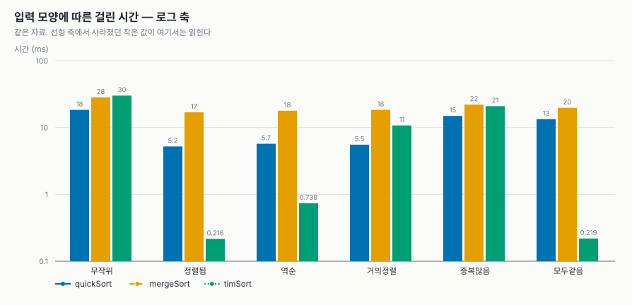
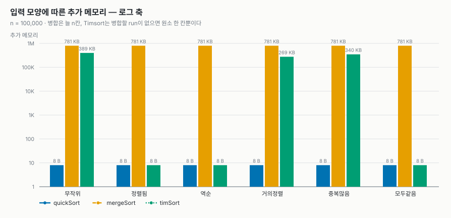
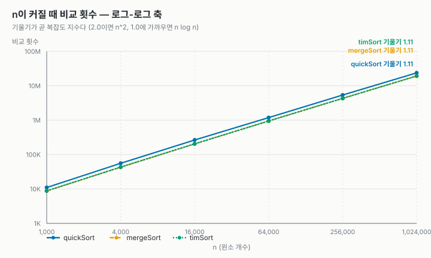
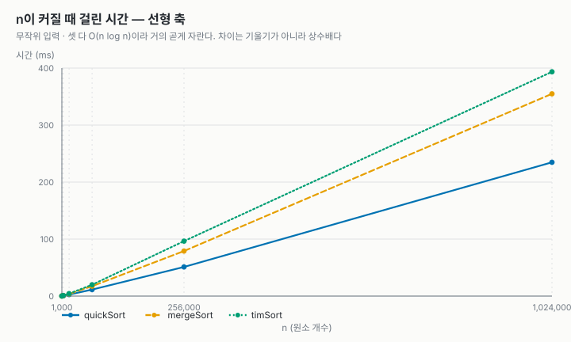
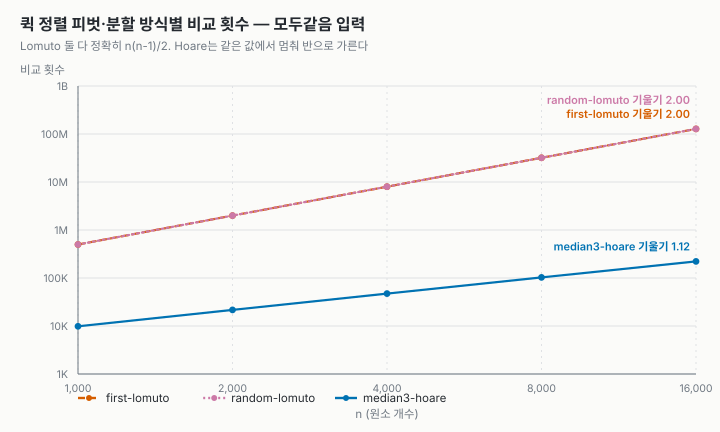
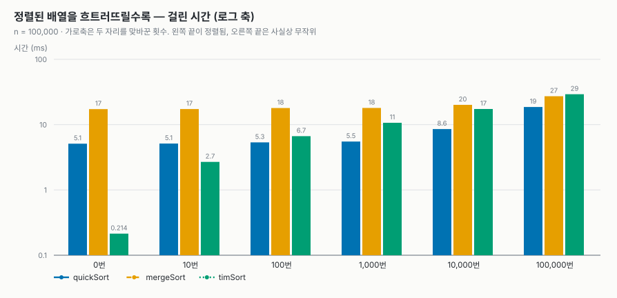

# 과제 1. 정렬 비교: 퀵 정렬, 병합 정렬, Timsort

- GitHub 저장소: <https://github.com/jkn614/algorithms-hw1>
- 비교한 정렬: 배운 정렬 퀵 정렬과 병합 정렬, 배우지 않은 정렬 Timsort
- 실행 방법: make test (유닛 테스트), make run (비교 표), make charts (그래프)

## 1. 왜 이 셋을 골랐나

Timsort는 병합 정렬에 이미 정렬된 구간(run)은 그대로 쓰는 아이디어를 더한 정렬이라,
병합 정렬과 나란히 두면 무엇이 달라졌는지 직접 볼 수 있다. 퀵 정렬은 셋 중 유일하게
불안정하고 추가 배열을 쓰지 않는 정렬이라 안정성과 메모리 비교가 갈린다.

| | 퀵 정렬 | 병합 정렬 | Timsort |
| --- | --- | --- | --- |
| 시간 (최선 / 평균 / 최악) | n log n / n log n / n² | n log n / n log n / n log n | n / n log n / n log n |
| 추가 메모리 | 없음 (재귀 스택만) | n칸 | 많아야 n/2칸 |
| 안정 정렬 | 아니오 | 예 | 예 |

## 2. 구현

과제 샘플 저장소(lec-algorithm/hw1-sample-2026)의 구조를 그대로 썼다. 정렬 하나를
함수 포인터 구조체(SortAlgorithm)로 표현하고, 측정 코드와 테스트는 구현 표를 훑으며
세 정렬을 같은 방식으로 돌린다. 원소는 (key, tag)로 만들어서 정렬 후 같은 key끼리
tag 순서가 유지되는지로 안정성을 실제로 확인했다.

- **퀵 정렬** (src/quickSort.c): 세 값의 중앙값을 피벗으로, Hoare 분할, 짧은 쪽만 재귀.
  비교 실험용으로 교과서형(첫 원소 피벗 + Lomuto 분할) 버전도 같이 넣었다.
- **병합 정렬** (src/mergeSort.c): 수업에서 배운 하향식 그대로. 보조 배열 n칸을 쓴다.
- **Timsort** (src/timSort.c): run 찾기 → 짧은 run은 이진 삽입 정렬로 minrun까지 늘리기 →
  run 스택 규칙에 따라 병합. 원본에 있는 galloping 모드는 넣지 않은 간소화 버전이다.

검증: make test로 50개 검사(여러 크기, 입력 모양, qsort 결과 대조, 안정성)가 모두 통과한다.

## 3. Timsort: AI를 통해 학습한 내용

Timsort는 수업에서 다루지 않아 AI(Claude)에게 질문하며 공부했다. 정리한 내용은 다음과 같다.

- **무엇인가**: 2002년 Tim Peters가 Python의 list.sort()용으로 만든 안정 정렬이다.
  병합 정렬과 삽입 정렬을 섞은 하이브리드이고, Java의 객체 배열 정렬(Arrays.sort)에도 쓰인다.
- **run**: 이미 오름차순으로 정렬된 연속 구간이다. 엄격한 내림차순 구간은 뒤집어서 run으로 쓴다.
  (같은 값이 섞인 구간을 뒤집으면 순서가 바뀌어 안정성이 깨지므로 엄격한 내림차순만 뒤집는다.)
- **minrun**: 무작위 데이터는 run이 너무 짧아서, 32–64개가 될 때까지 이진 삽입 정렬로 늘린다.
  삽입 정렬은 원소가 적을 때 가장 빠른 편이기 때문이다.
- **run 스택 규칙**: 위쪽 세 run 길이 X, Y, Z에 대해 X > Y + Z, Y > Z가 유지되도록 병합한다.
  비슷한 길이끼리 합쳐지게 해서 병합 정렬처럼 균형이 맞는다.
- **galloping**: 병합 중 한쪽 run이 계속 이기면 한 칸씩 비교하지 않고 건너뛰는 최적화.
  이번 구현에는 넣지 않았다.

AI 설명 중 실험으로 확인한 것: 정렬된 입력에서 비교 n-1번, 보조 메모리가 병합 정렬의 절반 이하,
부분적으로 정렬될수록 빨라지는 점. 확인하지 못한 것: galloping의 효과, minrun 32–64가 최적인지.

## 4. 실험

같은 입력을 세 정렬에 똑같이 주고 시간, 비교 횟수, 추가 메모리, 안정성을 쟀다. 입력은 씨앗을
고정해 매번 같게 만들었고, 시간은 5회 평균이다. 시간은 컴퓨터마다 달라지므로 비교 횟수를 함께 봤다.
측정값 원본은 저장소의 report/*.csv에 있다.

### 4.1 입력 모양별 (n = 100,000)

| 입력 | 퀵 (ms) | 병합 (ms) | Timsort (ms) | 퀵 비교 | 병합 비교 | Timsort 비교 |
| --- | ---: | ---: | ---: | ---: | ---: | ---: |
| 무작위 | **18.4** | 28.3 | 30.1 | 1,995,560 | 1,536,770 | 1,552,179 |
| 정렬됨 | 5.2 | 16.9 | **0.2** | 1,606,802 | 815,024 | 99,999 |
| 역순 | 5.7 | 17.9 | **0.7** | 1,606,803 | 853,904 | 99,999 |
| 거의정렬 (1%만 섞음) | **5.5** | 18.4 | 10.7 | 1,645,215 | 1,304,193 | 1,179,318 |
| 중복많음 (값 8종) | **14.9** | 22.0 | 20.9 | 1,681,053 | 1,463,633 | 1,348,619 |
| 모두같음 | 13.4 | 19.7 | **0.2** | 1,598,987 | 815,024 | 99,999 |

- 추가 메모리: 퀵 8 B, 병합은 항상 800,008 B, Timsort는 8~398,576 B (병합할 run이 없으면 8 B).
- 안정성: 병합 정렬과 Timsort는 모든 입력에서 안정. 퀵은 같은 값이 있는 입력에서 불안정으로 나왔다.

### 4.2 n을 키우며 (무작위 입력)

n = 1,024,000에서 퀵 234.7 ms, 병합 354.8 ms, Timsort 393.5 ms. 로그-로그 그래프의 기울기는 셋 다
1.11로, 같은 구간에서 n log n의 기울기(1.10)와 거의 같았다.

### 4.3 퀵 정렬: 피벗과 분할 방식 바꿔 보기 (n = 16,000)

| 입력 | 첫 원소 + Lomuto | 무작위 피벗 + Lomuto | 중앙값 + Hoare (기본) |
| --- | ---: | ---: | ---: |
| 정렬됨 (비교 횟수) | 127,992,000 | 266,961 | 222,863 |
| 모두같음 (비교 횟수) | 127,992,000 | 127,992,000 | 221,451 |
| 모두같음 (재귀 깊이) | 16,000 | 16,000 | 13 |

### 4.4 정렬된 배열을 조금씩 섞으면 (n = 100,000)

정렬된 배열에서 두 원소 자리를 맞바꾸는 횟수를 늘려 가며 쟀다.

| 맞바꾼 횟수 | 0 | 10 | 100 | 1,000 | 10,000 | 100,000 |
| --- | ---: | ---: | ---: | ---: | ---: | ---: |
| 퀵 (ms) | 5.1 | 5.1 | 5.3 | 5.5 | 8.6 | 18.6 |
| 병합 (ms) | 17.3 | 17.3 | 18.0 | 18.0 | 20.1 | 27.2 |
| Timsort (ms) | 0.2 | 2.7 | 6.7 | 10.7 | 17.4 | 29.2 |

## 5. 결과 해석

1. 무작위 입력에서 퀵 정렬은 비교 횟수가 병합 정렬보다 많았지만(약 200만 대 154만), 이동 횟수는
   절반 이하였다(약 145만 대 334만). 비교와 이동 횟수에서 차이가 나고, 퀵 정렬의 장점이 여기서 드러난다.
2. 병합 정렬은 입력이 이미 정렬되어 있어도 무조건 나누고 비교하는 절차 자체가 바뀌지 않는다.
   그래서 정렬된 입력에서 병합 정렬은 16.9 ms, Timsort는 0.2 ms였다.
3. 모든 값이 같을 때 Lomuto 분할은 피벗과 같은 값을 한쪽으로 몰아서 보내기 때문에 다른 쪽이 비어 버린다.
   그래서 무작위 피벗으로 바꿔도 비교가 127,992,000번으로 똑같이 느렸다. 문제는 피벗이 아니라 분할 방식이었다.

## 6. 결론 및 소감

각각의 정렬마다 장단점이 있으므로 데이터별로 상황에 맞게 골라야 한다. 예를 들어 무작위 데이터에서는
퀵 정렬이, 이미 어느 정도 정렬된 데이터에서는 Timsort가 가장 빨랐다.

처음에 이해하기 어려웠던 각각의 정렬, 특히 퀵 정렬을 좀 더 실질적으로, 자세히 알게 돼서 좋았다.

## AI 사용 내역

- Timsort의 개념(3장)은 AI(Claude)에게 질문하며 학습했다.
- 세 정렬의 C 구현, 테스트, 측정과 그래프 스크립트, 이 보고서의 초안(1–4장)은 Claude의 도움을 받아
  작성했고, 코드를 읽고 실행해 결과를 확인했다.
- 결과 해석(5장)과 결론 및 소감(6장)은 직접 작성했고, 표의 수치 인용과 일부 표현은 Claude의 도움을 받아 다듬었다.

## 참고

- Wikipedia, Sorting algorithm (Comparison of algorithms), Timsort
- CPython Objects/listsort.txt (Tim Peters의 Timsort 설명)
- 과제 샘플: lec-algorithm/hw1-sample-2026
